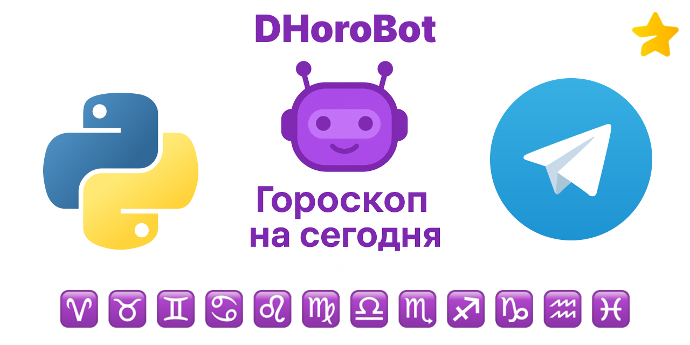

# **DHoroBot v5.1.1**



**DHoroBot** — это open source Telegram-бот, который ежедневно предоставляет актуальные гороскопы для всех знаков зодиака.
Проект создан для свободного использования, легко интегрируется в группы, форумы и личные чаты, и работает на основе данных с [horo.mail.ru](https://horo.mail.ru).

## **Структура проекта**

* `bot.py` — основной модуль Telegram-бота (команды, сообщения, коллбэки).
* `parser.py` — парсер гороскопов с horo.mail.ru.
* `db.py` — взаимодействие с SQLite (пользователи, группы, настройки).
* `keyboards.py` — управление клавиатурами и данными знаков зодиака.
* `regular.py` — вспомогательные регулярные выражения и функции очистки текста.
* `.env.example` — шаблон конфигурации (токен бота и ID администратора).

## **Описание модулей**

### **bot.py**

Основной модуль, реализующий функциональность бота.
Поддерживает команды:

* `/start` — регистрация пользователя и вывод ежедневных гороскопов;
* `/name` — изменение имени;
* `/birthdate` — добавление и редактирование даты рождения;
* `/chat` — ссылка на официальный чат;
* `/stat` — статистика пользователей и групп (для администратора).

### **db.py**

Работа с базой данных SQLite:

* Создание и обновление таблиц при первом запуске;
* Регистрация пользователей;
* Сохранение имени и даты рождения;
* Учёт групп и статистика.
### **keyboards.py**
Модуль управления клавиатурами:
* `zodiac_signs` — словарь со всеми знаками зодиака;
* `get_zodiac_keyboard()` — генерация клавиатуры со знаками зодиака;
* `get_cancel_keyboard()` — клавиатура с кнопкой отмены операции.

### **regular.py**

Вспомогательный модуль с регулярными выражениями:

* `remove_tags(text)` — удаляет HTML-теги;
* `is_valid_birthdate(date)` — проверяет корректность формата `ДЕНЬ.МЕСЯЦ.ГОД`.

### **parser.py**

Парсер гороскопов с сайта [horo.mail.ru](https://horo.mail.ru).
Поддерживает получение гороскопов:

* для всех знаков зодиака за сегодня;
* для конкретного знака и периода (сегодня, завтра, неделя, месяц, год).

### **.env.example**

Шаблон конфигурации окружения:

```bash
# Токен Telegram-бота
TOKEN=

# ID администратора
ADMIN=

# OpenAI API Key
OPENAI_API_KEY=sk-...
```

## **Использование**

1. Запустите `bot.py`.
2. При первом запуске бот автоматически зарегистрирует вас.
3. Используйте команды `/name` и `/birthdate` для настройки профиля.
4. Введите свой знак зодиака (например, «рак сегодня») для получения гороскопа.
5. Добавьте бота в группу или форум для коллективного использования.

## **Зависимости**

* Python 3.x
* BeautifulSoup4
* Telebot
* SQLite3
* python-dotenv

## **Установка**

```bash
git clone https://github.com/king-tri-ton/DHoroBot
cd DHoroBot
pip install -r requirements.txt
mv .env.example .env
python bot.py
```

---

Если у вас есть предложения или вопросы — пишите в Telegram: [@king_triton](https://t.me/king_triton).
Проект распространяется по лицензии [MIT](LICENSE).